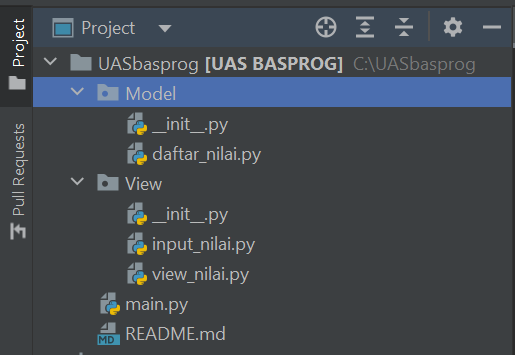

# UASbasprog
### Nama    : Sutan Krisno Adi
### NIM     : 312210056
### Kelas   : TI.22.C1

# Struktur Package & Module

# Penjelasan:

## Model

daftar_nilai

- tambah data
    - data = {} untuk menampung list data yang nanti akan terinput
    - deklarasikan fungsi def tambah_data():
    - nama = input("Masukan nama: ") lalu tambahkan input nama, nim, nilai tugas, uts, uas
    - nilai_akhir = (nilai_tugas)*30/100 + (nilai_uts)*35/100 + (nilai_uas)*35/100 untuk nilai akhir yang diambil dari perhitungan 3 komponen nilai (nilai_tugas: 30%, nilai_uts: 35%, nilai_uas: 35%)
    - data[nama] = [nama, nim, nilai_tugas, nilai_uts, nilai_uas, nilai_akhir] kita akan masukkan data yang tadi kita input ke dalam `data[nama]'
    - lalu cetak print()